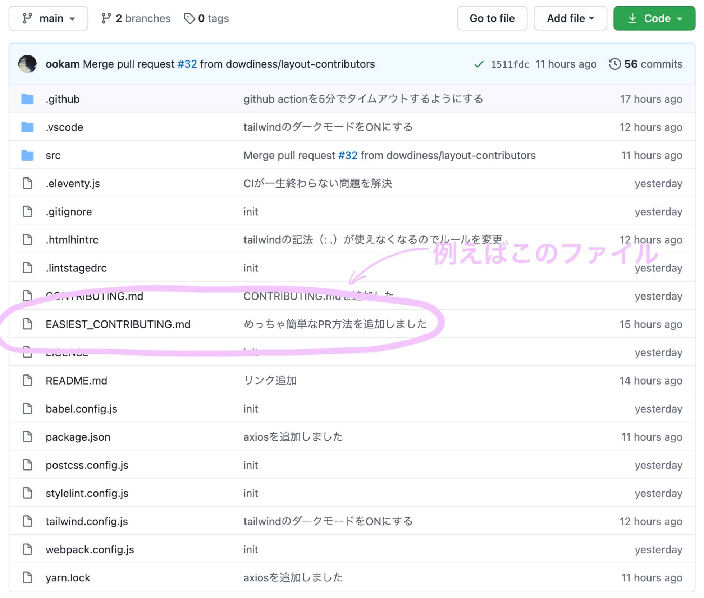
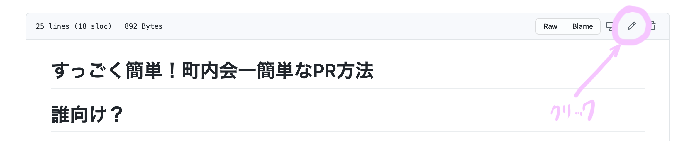
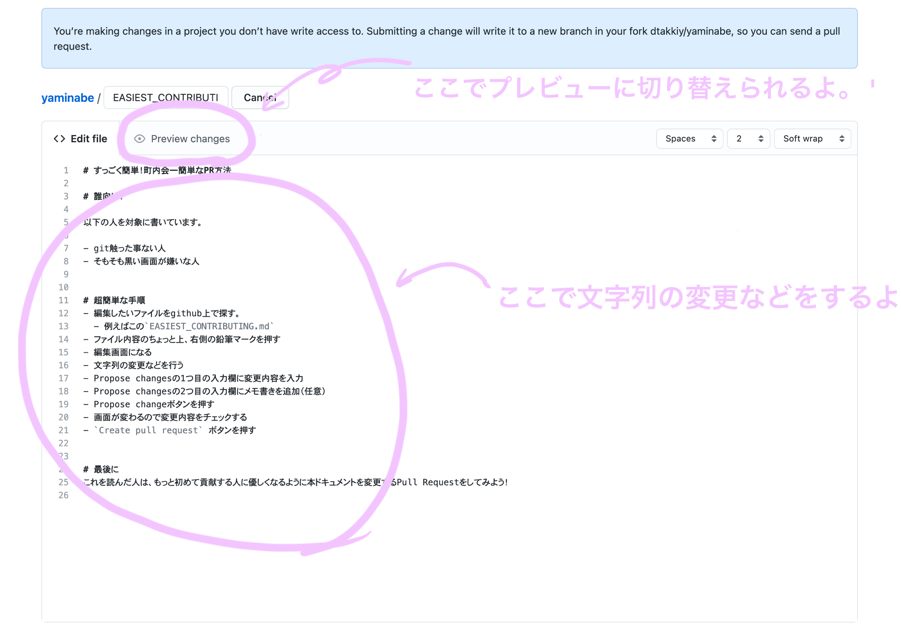
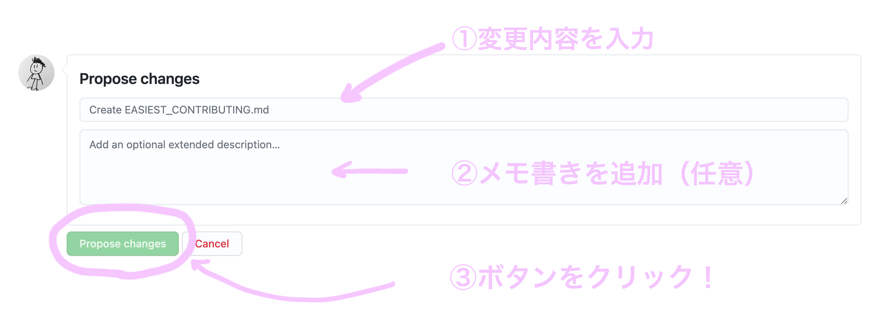
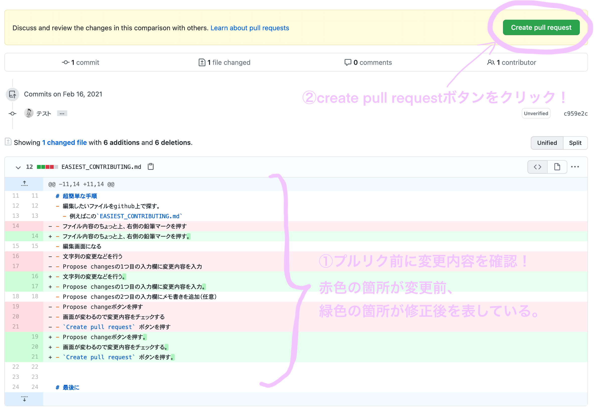

# すっごく簡単！町内会一簡単なPR方法

# 誰向け？

以下の人を対象に書いています。

- git触った事ない人
- そもそも黒い画面が嫌いな人

# 超簡単な手順

- 編集したいファイルをgithub上で探す。
  - 例えばこの`EASIEST_CONTRIBUTING.md`
    
- ファイル内容のちょっと上、右側の鉛筆マークを押す
  
- 編集画面になる
- 文字列の変更などを行う
  
- Propose changesの1つ目の入力欄に変更内容を入力
- Propose changesの2つ目の入力欄にメモ書きを追加（任意）
- Propose changeボタンを押す
  
- 画面が変わるので変更内容をチェックする
- `Create pull request` ボタンを押す

  

# 最後に

これを読んだ人は、もっと初めて貢献する人に優しくなるように本ドキュメントを変更するPull Requestをしてみよう！
